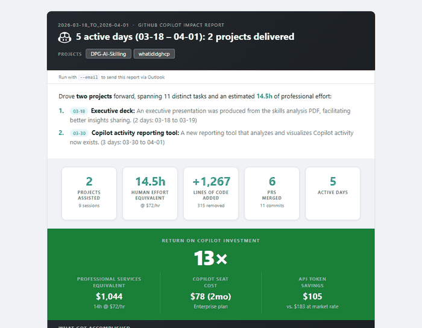

<div align="center">

# 🤖 What I Did — GitHub Copilot Impact Report

**Turn invisible AI collaboration into a visible story of impact.**

*One command generates a polished report on what you built with Copilot, the skills it augmented, and the leverage it delivered.*

[](https://python.org)
[](https://github.com/features/copilot)

</div>

---

> **"In March, Copilot delivered $4,380 worth of professional services for a $39/mo seat — a 112× return on investment."**
> — *Real output from this tool*

*"Where did the tokens go? What am I actually building with Copilot? Am I accessing skills I didn't have before?"*

If you can't answer these confidently, you're not alone. Most developers know Copilot helps — but can't show *how much*, *at what*, or *why it matters*. This tool turns your local session logs into a single report that makes the invisible visible — what got built, what skills were augmented, and what it would have cost to do it alone.

**Built for anyone who works with Copilot** — developers, PMs, analysts, vibe coders, and anyone building with AI. Use it to recap what you created, share progress with your team and manager, or generate evidence for performance reviews. If Copilot helped you build it, this tool makes sure the story gets told.

### ✅ What Got Accomplished — and the Leverage Behind It
Every project broken down into tasks with **human effort equivalents** — see that a 10-minute Copilot session replaced 3 hours of manual work. The ROI banner distills it to one number: how many multiples of your $39/mo seat Copilot delivered in professional services value.

### 📦 What Got Produced
Tangible artifacts — scripts, reports, documents, presentations, config files — categorized and counted. Not "Copilot helped me code" but "Copilot helped me ship 4 Python modules, 2 HTML reports, and a PowerShell deployment script."

### 🧠 Skills Copilot Augmented
Hours of assistance mapped across **20+ professional roles** — Software Engineer, Data Analyst, UX Designer, Solutions Architect, and more. See exactly which disciplines Copilot staffed for you, on demand, at zero headcount cost.

### 🎯 How You Collaborated
Every interaction classified by intent — **Building, Researching, Designing, Investigating, Iterating, Shipping**. Discover your collaboration signature and whether Copilot is an always-on tax or a targeted force multiplier.

### ⏰ When You Collaborated
Time-of-day activity patterns with a daily heatmap — spot whether you're an early-morning builder or a late-night debugger, and whether AI assistance is concentrated or spread across your day.

### 📐 Complexity Evidence
Collapsible estimation detail showing the quantitative signals behind every effort number — tool invocations, premium requests, token volumes, and the deterministic formula. Evidence that Copilot isn't just handling boilerplate — it's tackling real complexity.

## 📸 Sample Report

<div align="center">
<em>Report generated with <code>python whatidid.py --14D</code></em>


</div>

## 🚀 Quick Start

### 1. Clone the repo

```bash
git clone https://github.com/microsoft/What-I-Did-Copilot.git
cd What-I-Did-Copilot
```

### 2. Open in GitHub Copilot CLI or VS Code
   
```bash
# Option A: Open in VS Code with Copilot
code What-I-Did-Copilot
   
# Option B: Use GitHub Copilot in the terminal
cd What-I-Did-Copilot
gh copilot
```

### 3. Run your first report

```bash
# Last 7 days (default)
python whatidid.py

# Lookback shortcuts — any number of days
python whatidid.py --7D
python whatidid.py --14D
python whatidid.py --30D

# Specific date
python whatidid.py --date 2026-03-19

# Date range (e.g., all of March)
python whatidid.py --from 2026-03-01 --to 2026-03-31

# Send report via Outlook (auto-detects your email from GitHub auth)
python whatidid.py --email

# Send to a specific address
python whatidid.py --14D --email you@company.com

# Force re-analysis (bypass cache)
python whatidid.py --refresh
```

### 4. (Optional) Set up a shortcut

Add this to your PowerShell profile (`$PROFILE`) so you can run `whatidid` from anywhere:

```powershell
function whatidid { python "C:/path/to/What-I-Did-Copilot/whatidid.py" @args }
```

Then:
```bash
whatidid --14D --email
```

## 🏗️ How It Works

```
~/.copilot/session-state/<uuid>/events.jsonl
                │
                ▼
           harvest.py    → scan sessions, extract messages, tools, files, intents
                │
                ▼
           analyze.py    → AI categorization via GitHub Models API (gpt-4o-mini)
                │         → calibrated effort estimation with quantitative signals
                ▼
           report.py     → HTML report: story arc, donut charts, heatmaps, ROI
                │
                ▼
         whatidid.py     → opens report in browser; --email sends via Outlook COM
```

See [docs/architecture.md](docs/architecture.md) for session file formats, token cost model, and leverage calculation details.

See [docs/effort-estimation-methodology.md](docs/effort-estimation-methodology.md) for the research basis, signal definitions, and calibration logic behind effort estimates.

## 📋 Requirements

| Requirement | Why |
|---|---|
| **Python 3.10+** | Core runtime |
| **GitHub CLI (`gh`)** | Provides API token for AI analysis — run `gh auth login` |
| **GitHub Copilot** | Session data source — must have active sessions in `~/.copilot/session-state/` |
| **Microsoft Outlook** | *(Optional)* For `--email` delivery via COM automation — auto-detects recipient from GitHub auth |

No `pip install` needed — the core report generator (`harvest.py`, `analyze.py`, `report.py`, `whatidid.py`) uses only the Python standard library + GitHub Models API.

## 🤝 Copilot Agent

This tool ships as a **Copilot CLI agent**. Anyone who clones the repo gets it automatically — run `/agent` in Copilot CLI and select `whatidid`, or just ask naturally:

> "What did I build this week?"

See [`.github/agents/whatidid.agent.md`](.github/agents/whatidid.agent.md) for the agent definition.

## 📄 License

MIT

---

<sub>**Keywords:** GitHub Copilot ROI, Copilot usage report, Copilot activity tracker, AI productivity metrics, token usage analysis, Copilot impact measurement, developer productivity, AI-assisted development analytics</sub>
