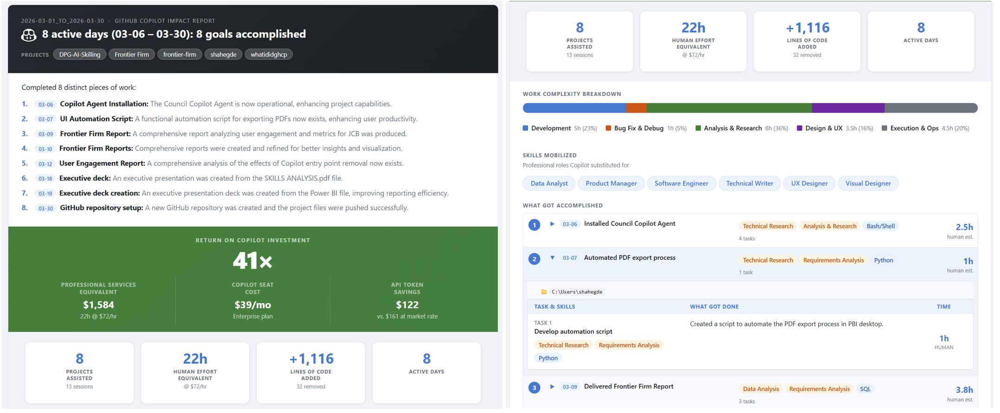

<div align="center">

# 🤖 What I Did — GitHub Copilot Impact Report

**See exactly what GitHub Copilot accomplished for you — in dollars, hours, and more importantly skills substituted.**

*Automatically harvests your Copilot session data, uses AI to categorize every task, and produces a polished impact report you can share with your team or manager. Fearlessly answer any questions around those tokens consumed*

[](https://python.org)
[](https://github.com/features/copilot)

</div>

---

> **"In March, Copilot delivered $4,380 worth of professional services for a $39/mo seat — a 112× return on investment."**

That's a real output from this tool. It reads your local Copilot session logs, classifies every task with AI, estimates what a human professional would charge, and renders a report with:

- 🎯 **Projects & tasks** — what you actually accomplished, grouped by business outcome
- ⏱️ **Professional services equivalent** — what it might cost you to get the same done by a professional
- 💰 **ROI multiplier** — your $39/mo seat vs. the value delivered
- 📊 **Fixed vs. market pricing** — what the same tokens would cost at public API rates
- 🛠️ **Skills mobilized** — the professional roles Copilot substituted for (engineer, designer, analyst…)
- 📈 **Code impact** — lines added/removed, PRs created, active days

## 📸 Sample Report

<div align="center">
<em>Report generated with <code>whatidid --from 2026-03-01 --to 2026-03-30</code></em>

<!-- Replace with actual screenshot: take a full-page screenshot of a generated report and save as docs/images/sample-report.png -->

</div>

## 🚀 Quick Start

### 1. Clone the repo

```bash
git clone https://github.com/microsoft/mycopilotworks.git
cd mycopilotworks
```

### 2. Open in GitHub Copilot CLI or VS Code
   
```bash
# Option A: Open in VS Code with Copilot
code mycopilotworks
   
# Option B: Use GitHub Copilot in the terminal
cd mycopilotworks
gh copilot
```

### 3. Run your first report

```bash
# Today's report
python whatidid.py

# Specific date
python whatidid.py --date 2026-03-19

# Date range (e.g., all of March)
python whatidid.py --from 2026-03-01 --to 2026-03-30

# Save HTML without emailing
python whatidid.py --from 2026-03-01 --to 2026-03-30 --html

# Send report via Outlook
python whatidid.py --email you@company.com

# Force re-analysis (bypass cache)
python whatidid.py --refresh
```

### 4. (Optional) Set up a shortcut

Add this to your PowerShell profile (`$PROFILE`) so you can run `whatidid` from anywhere:

```powershell
function whatidid { python "C:/path/to/mycopilotworks/whatidid.py" @args }
```

Then:
```bash
whatidid --from 2026-03-01 --to 2026-03-30 --html
```

## 🏗️ How It Works

```
~/.copilot/session-state/<uuid>/events.jsonl
                │
                ▼
           harvest.py    → scan sessions, extract instructions, tools, metrics
                │
                ▼
           analyze.py    → AI categorization via GitHub Models API (gpt-4o-mini)
                │         → calibrated effort estimation with quantitative signals
                ▼
           report.py     → Outlook-compatible HTML with ROI, skills, goal breakdown
                │
                ▼
         email_send.py   → send via Outlook COM automation (optional)
```

See [docs/architecture.md](docs/architecture.md) for session file formats, token cost model, and leverage calculation details.

## 📋 Requirements

| Requirement | Why |
|---|---|
| **Python 3.10+** | Core runtime |
| **GitHub CLI (`gh`)** | Provides API token for AI analysis — run `gh auth login` |
| **GitHub Copilot** | Session data source — must have active sessions in `~/.copilot/session-state/` |
| **Microsoft Outlook** | *(Optional)* For email delivery via COM automation |

No `pip install` needed — the tool uses only Python standard library + GitHub Models API.

## 🤝 Copilot CLI Skill

This tool can also be invoked as a [GitHub Copilot CLI](https://githubnext.com/projects/copilot-cli) skill. See [skill/SKILL.md](skill/SKILL.md) for the skill definition.

## 📄 License

MIT
