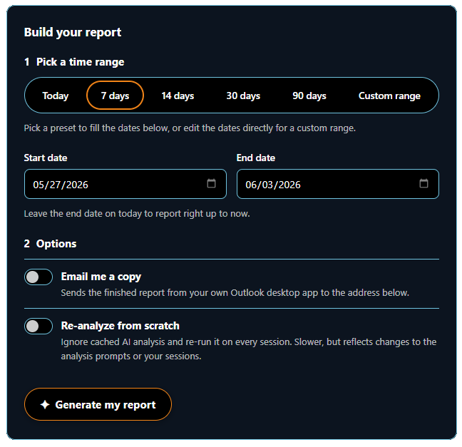

# What I Did with Copilot

### Turn your GitHub Copilot history into a polished impact report — in one click.

*See — and share — everything Copilot helped you get done. No terminal, no spreadsheets, no jargon.*

---

## Why you'll love it

You've been pairing with GitHub Copilot all week. **What actually got done?** This extension reads your local Copilot session history and turns it into a clean, branded, one-page report you can read in a minute — or send to your manager, your team, or your future self.

- 🟢 **One click.** A friendly Report Builder lives right inside VS Code. Pick a range, hit *Generate*.
- 📊 **Real impact, in plain English.** A headline estimate of time saved, plus a readable story of what you worked on.
- 🚀 **Project by project.** Every project you touched, the features that shipped, and the skills you leaned on.
- 🧮 **No black box.** The time-saved number is backed by a transparent, research-grounded method you can inspect.
- 🔒 **Private by design.** Everything is generated on your own machine from your own logs. Nothing is uploaded or tracked.

---

## How it works

1. **Pick a range** — quick presets (Today, 7 / 14 / 30 / 90 days) or an exact **custom start & end date** with real date pickers.
2. **Generate** — your Copilot sessions are read locally and summarized into a single page.
3. **Read or share** — the report opens right inside VS Code. Open it in a browser, or have it emailed to you.

---

## Getting started

1. Click **✦ What I Did** in the status bar, or run **What I Did: Open Report Builder** from the Command Palette.
2. Choose a time range. For exact control, pick **Custom range** and set start/end dates.
3. Flip the toggles you want:
   - **Email me a copy** — sends the finished report from your own Outlook desktop app to your detected email address.
   - **Re-analyze from scratch** — re-reads every session instead of reusing cached results (slower, freshest data).
4. Click **Generate my report**. Progress streams in the panel; the finished report opens in a new tab.

---

## What's inside the report

| | |
| --- | --- |
| 📊 **Headline impact** | How much time Copilot saved you across the period, at a glance. |
| 📝 **Plain-language story** | A short narrative of what you worked on — written so anyone can follow it. |
| 🚀 **Projects & what got built** | Each project, the features shipped, and the skills involved. |
| 🧮 **How the estimate is made** | Transparent, research-backed math behind the time-saved number. |

---

## Requirements

- **Python 3** — uses the interpreter selected by the Microsoft Python extension, or `python` on your PATH. Override with `whatidid.pythonPath`.
- **GitHub CLI** (`gh`) authenticated once via `gh auth login`, *or* a `GITHUB_TOKEN` environment variable — enables AI-powered analysis. Without either, the report falls back to a local heuristic (no AI tokens used).
- **Outlook desktop** (optional) — only needed if you use the *Email me a copy* toggle. The report is sent through your local Outlook profile to your own address; the extension never connects to an external mail server.

---

## Settings

| Setting | Description |
| --- | --- |
| `whatidid.pythonPath` | Path to the Python interpreter. Empty = auto-detect. |
| `whatidid.scriptPath` | Path to `whatidid.py`. Empty = use the bundled copy, or auto-detect one in the open workspace. |
| `whatidid.openInEditor` | Preview the report inside VS Code after generating (default: on). |

---

## Frequently asked

**Where does the email go, and what server does it use?**
To the email address detected for you (from the GitHub CLI, falling back to your `git config user.email`). It's sent through the **Outlook desktop app already installed on your PC** — there's no separate SMTP server, password, or cloud service involved. If you'd rather not email anything, just leave the toggle off.

**Does any of my data leave my machine?**
No. Reports are built locally from your Copilot logs. The optional AI analysis sends session summaries to GitHub Models using *your* credentials; turn it off to stay fully local. The extension itself adds no telemetry.

**Do I need to remember any commands?**
No — everything is point-and-click in the Report Builder. The underlying CLI is still there if you want it.

---

## Privacy

Everything runs locally. The extension only launches the bundled Python tool on your machine; it adds no telemetry or tracking of its own. The privacy note shown on every report is intentional.

> **A note on the numbers.** Credit and cost figures in the report are estimates, calculated from the token counts in your local session logs and GitHub's published per-model rates. They give an accurate picture of the shape of your AI usage, but your actual GitHub bill can differ depending on your plan, included credit allowance, and billing details that aren't visible in local logs.
